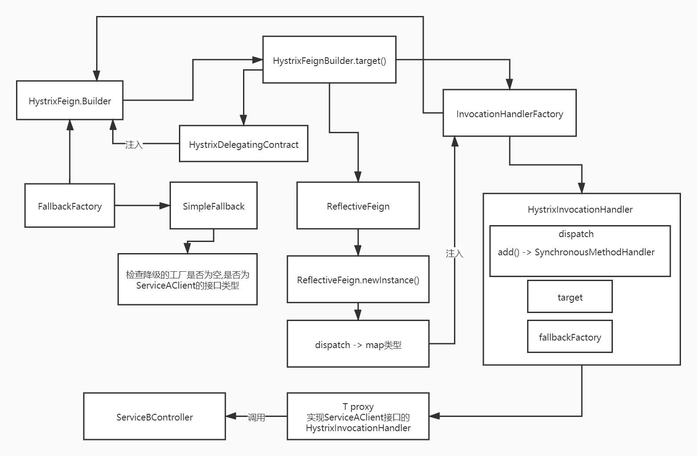

      hystrix几乎所有的核心逻辑，请求缓存、线程池、超时检测、异常检测、熔断触发，都几乎在这个方法里作为入口
      
      
## 一. 注解
       1) Used for asynchronous execution of command with a callback by subscribing to the {@link Observable}.
           这句话的意思是,会将command使用异步的方式来执行,扔到一个线程池里异步去泡,会拿到一个Observable对象,
           拿到这个对象后,如果要查看一些状态和结果,需要去订阅这个Observable对象,提供一个回调接口,订阅Observable对象
       2) This lazily starts execution of the command once the {@link Observable} is subscribed to
           这句话的意思是说,如果你获取了一个Observable对象之后,此时command其实没有立即执行,仅仅是封装到Observable对象里面,什么都没干
           如果订阅了Observable对象,提供了回调接口,才会触发Observable内部关联的command会去执行,根据command执行的结果会去回调你提供的接口
       3) An eager {@link Observable} can be obtained from {@link #observe()}.
           如果你希望一旦获取到Observable对象,就立即执行内部的command,那么就不要调用toObservable方法,要调用observable方法
##      二. _cmd 
            其实就是HystrixInvovationHandler里面创建的HystrixCommand的匿名内部类
##      三. 注解 
            doOnCompleted handler already did all of the SUCCESS work
           1. 如果你的command执行成功之后,会由doOnCompleted()来处理
           2. doOnError handler already did all of the FAILURE/TIMEOUT/REJECTION/BAD_REQUEST work
           3. 如果你的command执行过程中,出现了一些异常的情况,如 FAILURE(异常报错) / TIMEOUT(超时) / REJECTION(线程池满,被拒绝) / BAD_REQUEST(错误的请求)
##      四. Action0 terminateCommandCleanup 
            terminate终止 cleanup收尾
          1). 执行成功的回调,如果状态是OBSERVABLE_CHAIN_CREATED,就将状态设置为TERMINAL,同时执行handleCommandEnd(false)方法
               然后调用handleCommandEnd方法,将监听的线程给清理掉
          2). 如果状态是USER_CODE_EXECUTED , 就将状态设置为TERMINAL,同时执行handleCommandEnd(true)方法
               这里代表用户代码已经执行过了
##      五. Action0 unsubscribeCommandCleanup
##      六. Func0 applyHystrixSemantics 
            command真正执行的方法
###       1. executionHook.onStart()  里面啥都没干
           executionHook - 构造command的时候传递过来的, 包含一个executionHookDeprecationWrapper,是AbstractCommand的内部类
###       2. if (circuitBreaker.attemptExecution())
           circuitBreaker - 熔断器
           1). if (properties.circuitBreakerForceOpen().get()) 判断断路器是否手动打开,手动打开返回false
           2). if (properties.circuitBreakerForceClosed().get()) 判断断路器是否启动,如果没启用返回true
           3). if (circuitOpened.get() == -1) 判断断路器是否自动关闭,自动关闭则circuitOpened的值为-1
           4). if (isAfterSleepWindow())  进行以下4个判断
               1). circuitOpened 代表打开短路器的当前时间戳
               2). 如果circuitOpenTime(上次打开熔断器) + sleepWindowTime(配置项circuitBreaker.sleepWindowInMilliseconds,默认是5s)
               3). 如果当前时间小于熔断器打开时间+指定时间,返回false
               4). 否则返回去true
           5). 如果4)中返回true,则if (status.compareAndSet(Status.OPEN, Status.HALF_OPEN))将断路器状态设置为HALF_OPEN(半开模式)
           6). circuitBreaker.markSuccess() 如果尝试请求成功了,会调用这个方法,这个方法就会关闭熔断器
               (1). if (status.compareAndSet(Status.HALF_OPEN, Status.CLOSED))
                   如果成功了,且为半开状态,则会将半开状态改为关闭状态
                   metrics.resetStream() 重新对 metrics进行订阅
                   将circuitOpened改为-1
###       3. 判断隔离模式
           1). 如果不是为信号量,则什么逻辑都没有
           2). 如果不是为信号量,则什么逻辑都没有
###       4. 构造 Action0
           1). 这个call()里面的方法,代表发生了异常发生的回调
###       5. 构造 Action1
           1). 默认情况executionSemaphore.tryAcquire()就是true,代表可以执行的
           2). executionResult设置了一个开始执行的执行时间
           3). executeCommandAndObserve(_cmd)  观察命令的执行结果, 获取一个userObservable对象
               1. executeCommandWithSpecifiedIsolation(_cmd)  返回一个Observable<R>
               2. 施加了一个HystrixObservableTimeoutOperator  用于观察timeout的组件
###       6.这里定义timerout的超时监听逻辑
               1). originalCommand.isCommandTimedOut.compareAndSet(TimedOutStatus.NOT_EXECUTED, TimedOutStatus.TIMED_OUT)
                   1. 这里代表已经超时了,将状态从NOT_EXECUTED设置为TIMEOUT,并且抛出一个HystrixTimeoutException异常
                   2. 用于处理超时时间的Observable,其实就是监听我们command执行是否超时的一个监听器,如果command执行超时,那么此时就会回调TimerListener里面的方法
                   3. 如果在超时时间的时候执行完,执行状态不会变,会成为 COMPLETED , 然后把监听任务clear()掉
               2). Reference<TimerListener> tl = HystrixTimer.getInstance().addTimerListener(listener)
                   (1). HystrixTimer.getInstance() 这里明显是拿到了一个HystrixTimer的东西,这是一个单例的HystrixTimer
                       如果超时了,就回调那个监听器
                   (2). addTimerListener(listener) 将上面所创建的  listener加到这个HystrixTimer的监听器里面
                       1. startThreadIfNeeded() 初始化一个AtomicReference<ScheduledExecutor> ,并调用initialize()方法
                       2. initialize()
                            1). 获取timerCoreSize的线程池大小
                           2). 创建timer线程的工厂,timer线程的名字叫 HystrixTimer-0 , 并设置为守护线程
                           3). 创建了一个用来进行调度的ScheduledThreadPoolExecutor线程池,默认大小是4
                   (3). Runnable r
                       1. 创建一个线程,调用TimerListener的tick()方法
                   (4). ScheduledFuture<?> f = executor.get().getThreadPool().
                       scheduleAtFixedRate(r, listener.getIntervalTimeInMilliseconds(), listener.getIntervalTimeInMilliseconds(), TimeUnit.MILLISECONDS);
                       1. 通过2)-(2)-2-2)中创建的timerPool来调度创建的Runnable r线程,定时调度
                       2. intervalTimeInMilliseconds 配置项是 hystrix.command.serviceA#sayHello(Long,String).execution.isolation.thread.timeoutInMilliseconds = 1000ms
                           按照默认设置,每隔1000ms就会跑一次这个任务,根据你设置的超时时间来进行调度
###           7. 获取执行的execution
               1). 如果隔离策略是线程池模式,构造一个叫execution的Observable
               2). 获取执行的状态
                   (1). 如果说要执行command了,结果command的state不是OBSERVABLE_CHAIN_CREATED,那么就会说在一个错误的state之下执行command,报错
                   (2). 如果状态正常,state状态为USER_CODE_EXECUTED
                   (3). threadPoolKey默认跟groupKey是一样的,一个服务对应一个线程池
####               3). 获取userObservable
                   (1). 线程池在执行的时候,状态一定为 NOT_USING_THREAD
                   (2). endCurrentThreadExecutingCommand = Hystrix.startCurrentThreadExecutingCommand(getCommandKey())
                       传入一个commandKey
                       压入到一个栈里面去
                   (3). 三个on方法,更改下状态
                   (4). getUserExecutionObservable
                       (1). getExecutionObservable()方法中中有一个Func0对象,
                       里面的call()方法就执行了我们自己写的run()方法,并返回一个userObservable
                       (2). 往userObservable中放入ExecutionHookApplication 和 DeprecatedOnRunHookApplication
                   (5). 将userObservable返回
                       如果要让一个Observable去执行的话,必须对这个Observable进行订阅,在这里的话,其实他内部先会搞一个subscribe订阅器出来,
                       然后用这个subscriber去订阅userObservable，然后才能触发userObservable的执行
               4). 执行具体的HystrixInvocationHandle里面的HystrixCommand.run()方法,具体执行是SynchronousMethodHandler
###           8. 降级处理异常
               针对所有异常,都会交给handlerFallback来处理,针对不同的异常来处理降级逻辑
               1). RejectedExecutionException
               2). HystrixTimeoutException
               3). HystrixBadRequestException
               4). else
##      七. Func1 wrapWithAllOnNextHooks
##      八. Action0 fireOnCompletedHook
###           1. threadPool.getScheduler
                核心逻辑,就是判断线程池是否已满,如果以满,则会报一个reject的异常
               还有的话,如果线程池没满,那么久会去通过线程池进行调度
###           2. touchConfig(); 
                默认情况下啥都不干,只有在你设置线程池动态增长的情况下才干活
###           3. getScheduler()
               1). 这里传入了一个threadPool,把自己传进去 , 这里会创建一个scheduler的一个worker,
               2). 类型为HystrixContextScheduler的worker,里面有判断线程池已满的逻辑
                   线程池满了之后,会报一个RejectedExecutionException
                   if (threadPool != null)
                       if (!threadPool.isQueueSpaceAvailable())
                           throw new RejectedExecutionException("Rejected command because thread-pool queueSize is at rejection threshold.");
                   return worker.schedule(new HystrixContexSchedulerAction(concurrencyStrategy, action), delayTime, unit);
               3) isQueueSpaceAvailable()逻辑为
               isQueueSpaceAvailable() {
                   if (queueSize <= 0) {
                       return true;
                   } else {
                       return threadPool.getQueue().size() < properties.queueSizeRejectionThreshold().get();
                   }
           4. new ThreadPoolScheduler(threadPool, shouldInterruptThread) 的createWorker方法会创建一个ThreadPoolWorker
               schedule()方法有进行command任务调度的方法
           5. HystrixThreadPoolDefault的getScheduler()方法,
               这里传入了一个threadPool,把自己传进去 , 这里会创建一个scheduler的一个worker,
                  类型为HystrixContextSchedulerWorker的worker,里面有判断线程池已满的逻辑
                   线程池满了之后,会报一个RejectedExecutionException
                   if (threadPool != null) {
                      if (!threadPool.isQueueSpaceAvailable()) {
                          throw new RejectedExecutionException("Rejected command because thread-pool queueSize is at rejection threshold.");
                      }
                   }
                   return worker.schedule(new HystrixContexSchedulerAction(concurrencyStrategy, action), delayTime, unit);
##      九. Func0<Observable<R>>()
###           1. 第一步 :
               if (!commandState.compareAndSet(CommandState.NOT_STARTED, CommandState.OBSERVABLE_CHAIN_CREATED))
               1). 刚开始做一个command状态的判断,如果说command状态不是NOT_STARTED,他就认为说你已经执行过一次command了,不会让你重复执行一个command
               2). 如果说command状态是NOT_STARTED , 则会将状态设置为 OBSERVABLE_CHAIN_CREATED
                   所以,Func0.call()就是command的入口,Observable.toBlocking()方法出发的
###           2. 第二步:
               if (properties.requestLogEnabled().get())
               尝试去处理日志,默认不处理hystrix日志的
###           3. 第三步:
               if (requestCacheEnabled) 检查是否启用了请求缓存,配置项是 requestCache.enabled
               默认情况下是不起用的
               如果启用的情况,会基于applyHystrixSemantics 和 wrapWithAllOnNextHooks创建
               一个HystrixObservable的东西
###           4. 第四步:
           afterCache
               .doOnTerminate(terminateCommandCleanup)
               .doOnUnsubscribe(unsubscribeCommandCleanup)
               .doOnCompleted(fireOnCompletedHook);
               基于上面(4,5,6,7,8)所构造的五个对象进行构造 Observable
##      十. Observable.toBlocking()之后,就会触发 9 中的 Func0.call()方法执行 ,
           1. 结果这个call方法中啥也没干,就是再次创建了一个hystrixObservable对象,把之前的五个对象塞进去
           所以判断,真正去执行command的方法,估计是在applyHystrixSemantics中去触发的